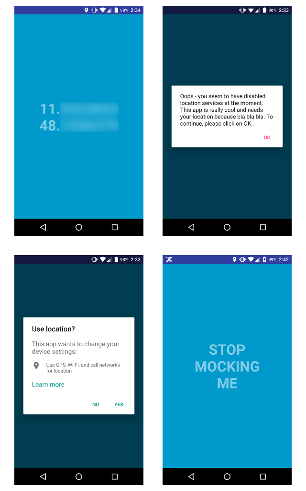

## LocationAssistant

Building a location-aware app on Android can be a hassle.
This project provides the __LocationAssistant__, a simple utility class that does most of the heavy lifting for you.
Furthermore, it allows you to robustly reject _mock locations_.

__Supported API level:__ 15+ (Android 4.0.3 and above)


## Why

It's actually a non-trivial task to build an app that reliably subscribes to location updates across a reasonable 
range of Android versions. Specifically, this involves checking and requesting permissions, checking and possibly 
enabling available location providers, bringing up in-app system dialogs or directing the user to the system 
settings, and finally - processing location updates.

In addition to merely subscribing to location updates, I needed to robustly reject mock locations (i.e. fake GPS 
locations broadcast by mock location providers) for a project I was working on. Unfortunately, this is also not 
straightforward, as Android's flag
[isFromMockProvider()](https://developer.android.com/reference/android/location/Location.html#isFromMockProvider%28%29)
turns out to be unreliable (meaning sometimes fake locations are not correctly labeled as such).

I struggled with Android's location issues for several days until I had what felt like an acceptable solution. In 
this repository I am making available the relevant source code and a small demo. I also wrote
[a detailed blog post](http://www.klaasnotfound.com/2016/05/27/location-on-android-stop-mocking-me/)
on the subject (if you want to learn more).


## Usage

1. Add this line to your `AndroidManifest.xml`, right after the opening `<manifest>`
tag:
    ``` xml
    <uses-permission android:name="android.permission.ACCESS_FINE_LOCATION" />
    ```

1. In your app's `build.gradle` file, add the following line to your `dependencies` :
    ``` groovy
    compile 'com.google.android.gms:play-services-location:9.4.0'
    ```
    
1. Copy the file
[`LocationAssistant.java`](app/src/main/java/com/klaasnotfound/locationassistant/LocationAssistant.java) to your 
project.

1. In your main Activity (the one that needs location updates), do the following:

  * Implement the `LocationAssistant.Listener` interface (see [below](#interacting-with-the-user)).

  * In the `onCreate()` method, instantiate a __LocationAssistant__ with the desired parameters.
	For example, to receive high-accuracy location updates roughly every 5 seconds _and_ reject mock locations, call:
	``` java
	assistant = new LocationAssistant(this, this, LocationAssistant.Accuracy.HIGH, 5000, false);
	```

  * Start/stop the __LocationAssistant__ when you resume/pause your Activity:
	```java
    @Override
    protected void onResume() {
        super.onResume();
        assistant.start();
    }

    @Override
    protected void onPause() {
        assistant.stop();
        super.onPause();
    }
	```

  * Notify the __LocationAssistant__ of permission and location settings changes:
	```java
    @Override
    public void onRequestPermissionsResult(int requestCode, String[] permissions, int[] grantResults) {
        assistant.onPermissionsUpdated();
    }

    @Override
    protected void onActivityResult(int requestCode, int resultCode, Intent data) {
        assistant.onActivityResult(requestCode, resultCode);
    }
  ```

1. Enjoy location updates in `onNewLocationAvailable(Location location)`.
That's it - you're done!

#### Interacting with the User

The `LocationAssistant.Listener` provides several callbacks that allow you to show certain information before the 
user is required to take action (give permission, switch on location providers etc.). These are:

* `onNeedLocationPermission()`
* `onExplainLocationPermission()`
* `onNeedLocationSettingsChange()`
* `onFallBackToSystemSettings()`
* `onMockLocationsDetected()`

The [documentation](#documentation) for these methods should be self-explanatory. You can choose wether you want to 
offer a detailed explanation in each callback or directly request the required action. Whenever the user is required 
to leave the app, the callback will provide convenience listeners that you can use to redirect her.

#### Application-wide Usage

If you want to receive location updates in several Activities, you can instantiate the __LocationAssistant__ in a 
central application class. Be sure to start and stop it 
[when the application becomes awake / goes to sleep]
(http://www.klaasnotfound.com/2015/08/24/tracking-the-application-lifecycle-on-android/).
Then, you can register/unregister each Activity and its listener with `register()` and `unregister()`. Note that only
the most recently registered Activity will receive updates. When no Activity is registered, you will see silent 
warnings in the log.

#### Errors and Logging

You will be notified of errors in the `Listener.onError()` callback. By default, errors will also appear in the log. 
If you want to switch these off (e.g. for the production version of your app) you can do so with `setQuiet()`. 
Finally, if you would like to see which locations are processed and possibly rejected as mock locations, you can 
request more log output with `setVerbose()`.


## Demo

To see a working a demo, clone this repository and build the project with Android Studio.



When the demo app detects mock locations it will simply say 'Stop mocking me'. You can tap on the message to jump to 
the developer settings and disable mock locations. In a real app, you should obviously provide better instructions.


## Documentation

#### LocationAssistant.Listener

  * `onNeedLocationPermission()` - Called when the user needs to grant the app location permission at run time.

  This callback will only be invoked on newer Android systems (API level >= 23), usually at the first start of your app.
  If you want to show some explanation up front, do that, then call `requestLocationPermission()`. Alternatively, you
  can call `requestAndPossiblyExplainLocationPermission()`, which will request the location permission right away 
  and invoke `onExplainLocationPermission()` only if the user declines.
  Both methods will bring up the in-app system permission dialog.

  * `onExplainLocationPermission()` - Called when the user has declined the location permission and might need a better
   explanation as to why your app really depends on it.

  You can show some sort of dialog or info window here and then - if the user is willing - ask again for permission 
  with `requestLocationPermission()`.

  * `onNeedLocationSettingsChange()` - Called when a change of the location provider settings is necessary.

  You can optionally show some informative dialog and then request the settings change with `changeLocationSettings()`.

  * `onFallBackToSystemSettings()` - Called when the user needs to jump to the system settings to enable location.

  In certain cases where the user has switched off location providers, changing the location settings from within the
  app may not work. The LocationAssistant will attempt to detect these cases and offer a redirect to the system 
  location settings, where the user may manually switch on location providers before returning to the app.
  You can prompt the user with an appropriate message (in a view or a dialog) and use one of the provided 
  OnClickListeners to jump to the settings.

  * `onNewLocationAvailable()` - Called when a new and valid location is available.

  If you chose to reject mock locations, this method will only be called when a real location is available.

  * `onMockLocationsDetected()` - Called when the presence of mock locations was detected and `allowMockLocations` is
   `false`.

  You can use this callback to scold the user or do whatever. The user can usually disable mock locations by either 
  switching off a running mock location app (on newer Android systems) or by disabling mock location apps altogether.
  The latter can be done in the phone's development settings. You may show an appropriate message and then use one of
  the provided OnClickListeners to jump to those settings.

  * `onError()` - Called when an error has occurred.

#### LocationAssistant

  * `start()`/`stop()` - Starts/stops the LocationAssistant and makes it subscribe to/unsubscribe from valid location
   updates.

  * `register()`/`unregister()` - Call this only if you need to subscribe to/unsubscribe from updates in several 
  Activities.

  * `getBestLocation()` - Returns the best valid location currently available.

  * `requestAndPossiblyExplainLocationPermission()` - The first time you call this method, it brings up a system 
  dialog asking the user to give location permission to the app. On subsequent calls, if the user has previously 
  declined permission, this method invokes `Listener.onExplainLocationPermission()`.

  * `requestLocationPermission()` - Brings up a system dialog asking the user to give location permission to the app.

  * `onPermissionsUpdated()` - Notifies the LocationAssistant of updated permissions.

  * `onActivityResult()` -  Notifies the LocationAssistant of updated location settings

  * `changeLocationSettings()` - Brings up an in-app system dialog that requests a change in location provider settings.

  * `setVerbose()` - Makes the LocationAssistant print info log messages.

  * `setQuiet()` -  Mutes all log output (including errors).


## Contact & Contribute

This is a small project. If you like it, you can [follow me on Twitter](https://twitter.com/klaasnotfound) or drop me
a comment on [my blog](www.klaasnotfound.com). If you spot an error or want to suggest an improvement, feel free to 
submit a PR or contact me via klaas [at] klaasnotfound.com.


## License

```
Copyright 2016 Klaas Klasing (klaas [at] klaasnotfound.com)

Licensed under the Apache License, Version 2.0 (the "License");
you may not use this file except in compliance with the License.
You may obtain a copy of the License at

    http://www.apache.org/licenses/LICENSE-2.0

Unless required by applicable law or agreed to in writing, software
distributed under the License is distributed on an "AS IS" BASIS,
WITHOUT WARRANTIES OR CONDITIONS OF ANY KIND, either express or implied.
See the License for the specific language governing permissions and
limitations under the License.
```
